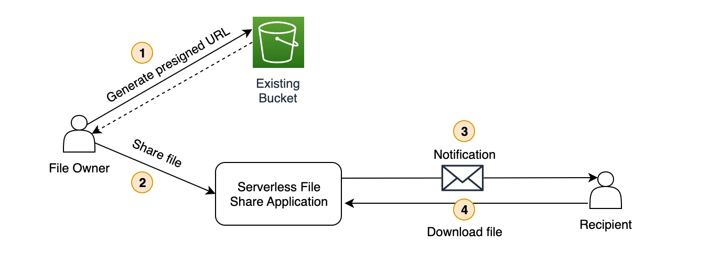

## AWS Serverless File Share Solution

### Background

[Amazon S3](https://aws.amazon.com/s3/) is a popular cloud storage service that many AWS customers use to store significant amounts of data.

AWS customers often want a way to securely share files with users who are non-AWS customers. One solution is to share [S3 Presigned URLs](https://docs.aws.amazon.com/AmazonS3/latest/userguide/ShareObjectPreSignedURL.html), however there are 3 key challenges:
1. Security - it is possible for users to share presigned urls with other users
2. Cost - there is no way to control data transfer costs as there is no way to limit downloads other than through expiry 
3. Monitoring - there is no mechanism to identify and track who is accessing the download url

Customers are looking for a simple way to share their data securely.

---

### High Level Solution Approach

The solution covers 2 scenarios

#### Scenario 1: Non AWS user uploading and sharing files with another non AWS user


For this flow, both file owner and recipient are required to sign up in the Serverless File Application using Cognito.

1. User uploads a file using the Serverless File Share Application.
**Note:** As a pre-requisite the user is required to login in using their email address via Cognito.

2. The file is stored in a bucket managed by the Serverless File Application.

3. The application sends a notification to the recipient which includes a download link

4. The recipient accesses the download link. The link will authenticate the user using Cognito first and then check if the recipient is allowed to download the file before serving the file. 

#### Scenario 2: AWS user sharing existing files with a non AWS user



For this flow, the file owner can be someone logged into their AWS account. Only the recipient is required to sign up to the Serverless File Application using Cognito.

1. File owner generates a presigned URL using S3 (e.g. via console, CLI or custom application)

2. File server calls an API in the Serverless File Share Application and passes details of the recipient who should receive the file.

3. The application sends a notification to the recipient which includes a download link

4. The recipient accesses the download link. The link will authenticate the user using Cognito first and then check if the recipient is allowed to download the file before serving the file. 

---

### Architecture

TODO

---

### Before you get started
**Step 1: Install dependencies**
```
npm install
```

**Step 2: Setup AWS profile (optional)** 

If you don't want to use the default AWS profile and use a specific profile, set an environment variable:

```
AWS_PROFILE=myProfile
```

In the project root folder create a file called ``.env`` and include the above.

**Step 3: Give your app a unique name** 

When the app is deployed, it will attempt to create a Cognito user pool. The name of the pool must be globally unique (at a region level).

The app name is based on the ```name``` attribute in ```package.json```. Update this attribute to use a unique name otherwise deployment will fail.  

---

### Building & Deploying

#### Build CDK package

Will generate CloudFormation template and compiled Lambda code.

```
yarn build
```

#### Deploy to AWS

Will build and deploy to AWS.

```
yarn deploy
```

#### For prod build/deployment

Will use environment variables in ```.env.prod``` instead of ```.env```

```
yarn build:prod
yarn deploy:prod
```

---

### API Specification

TODO: Update API spec

**```/download/{filepath}```**

Will redirect to an S3 presigned URL after first checking if the user is logged in to Cognito and is allowed to access the file.

If the user is not logged into Cognito, they will be redirected to the Cognito Hosted UI login screen.

**```/logout```**

Logout of Cognito and clear session/cookies.

---

### TODO List

1\. Add eligibility checks after authentication - e.g. has user reached their download quota

2\. Refactor download lambda function into an express step function:
* Step 1: Validate access token
* Step 2: Eligibility checks (dynamodb)
* Step 3: Record download
* Step 4: Generate presigned URL

3\. Work out if there is a way to redirect to presigned URL without changing the URL in the browser (i.e. keep user on API gateway url)

4\. Resolve API URL circular dependency to get rid of ugly code (e.g. hardcoding of /prod folder prefix)

5\. Add share functionality:
* API inputs - filepath, user to share with, permissions, number of downloads allowed, flag for whether an email notification should be sent
* Express step function:
* Step 1: Record permissions to database
* Step 2: If email flag present, send email via SNS/SES

6\. Add upload functionality?? upload directly to S3 or via API/Lambda?

7\. Add detailed observability metrics and reporting - e.g. how many downloads per user
